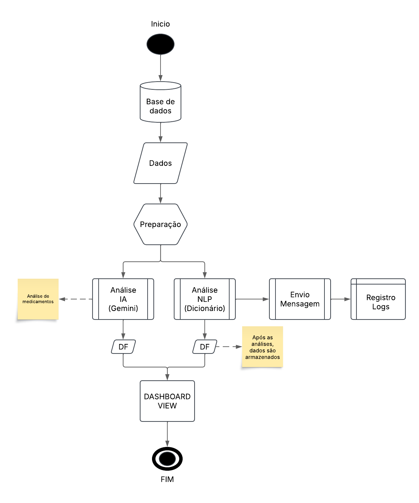

# CASE FOLKS - Captação Inteligente

📝 Descrição do Projeto

Este projeto tem como objetivo processar dados estruturados e não estruturados para a extração de informações relevantes, para assim identificar automaticamente os pacientes com solicitações de exames de imagem pendentes. 

O sistema utiliza **Flask**, **Pandas**, **SQLAlchemy** integrando **PostgreSQL**, **DASH**, utilização dA LLM **Gemini (GOOGLE)** para extração de informações a partir de textos livres nos dados não estruturados.

O sistema permite:
- Processamento de dados estruturados (exames com códigos TUSS)
- Processamento de dados não estruturados (análise de solicitações médicas)
- Disparo de mensagens
- Extração de informações sobre medicamentos via IA
- Geração de dashboards para análise

---

## 🚀 Tecnologias Utilizadas

- **Python 3.13.1**
- **Flask** (para criação da API)
- **SQLAlchemy** (para conexão com banco de dados PostgreSQL)
- **Pandas** (para processamento de dados)
- **Dash** (para visualização de dados em dashboards)
- **Google Gemini API** (para extração de informações via IA)

---

## 📂 Estrutura do Projeto

```bash
case_folks/
│-- src/
│   │-- main.py                  # API Flask principal (Estrutura de Rodas)
│   │-- database.py               # Conexão com o banco de dados PostgreSQL
│   │-- extract_estruturado.py    # Processamento de exames estruturados
│   │-- extract_n_estruturado.py  # Processamento de exames não estruturados
│   │-- extract_gemini.py         # Extração de informações com IA (GOOGLE GEMINI)
│   │-- dashboard.py              # Criação de Dashboard
│-- data/
│   │-- output/                             # Saída de dados
│   │-- parcial_dados_nao_estruturados.csv  # Amostra dados
│   │-- parcial_dados_estruturados.csv      # Amostra dados
│   │-- sample_estruturados_teste.csv       # Base teste estruturada 
│   │-- sample_estruturados.csv             # Base estruturada
│   │-- sample_nao_estruturados.csv         # Base ñ estruturada
│-- docs/                          # Documentação e arquivos auxiliares
│-- logs/                          # Arquivos de log
```

---

## 📦 Instalação e Configuração

### 🔹 1. Clonar o repositório
```bash
git clone https://github.com/guilhermebou/case_folks
```

### 🔹 2. Criar um ambiente virtual e instalar dependências
```bash
python -m venv venv
source venv/bin/activate  # Para Linux/Mac
venv\Scripts\activate     # Para Windows
pip install -r requirements.txt
```

### 🔹 3. Configurar o banco de dados PostgreSQL
- Certifique-se de que o PostgreSQL está rodando.
- O sistema pedirá `USER` e `PASSWORD` ao iniciar.
- O banco padrão usado é **folks**, rodando em **localhost**.

### 🔹 4. Executar a API
```bash
python main.py
```
A API rodará em **http://127.0.0.1:5000/**

### 🔹 5. Acessar o Dashboard
```bash
python dashboard.py
```
O dashboard estará acessível em **http://127.0.0.1:8050/**

---

## 🔗 Rotas da API

### ✅ **`GET /`**
- Verifica se a API está rodando.

### ✅ **`GET /sample_estruturado`**
- Processa dados estruturados do banco de dados.
- Gera relatórios de recorrência de pacientes, sazonalidade e exames por trimestre.
- Dispara mensagens aos pacientes com solicitações de exames de imagem pendentes.
- Salva os resultados na pasta `data/output/`.


  

### ✅ **`GET /sample_n_estruturado`**
- Processa dados não estruturados (exames sem padrão definido).
- Identifica exames solicitados a partir de um dicionário de exames de imagem.
- Salva o resultado na pasta `data/output/`.


---

## 📊 Funcionalidades dos Arquivos

### 🔹 **`database.py`**
- Configura a conexão com o PostgreSQL.
- Utiliza SQLAlchemy para criar a sessão com o banco.

### 🔹 **`extract_estruturado.py`**
- Processa exames estruturados (códigos TUSS).
- Envia mensagens automáticas para pacientes.
- Verifica recorrência de pacientes.
- Detecta sazonalidade bimestral.
- Conta exames por trimestre.

### 🔹 **`extract_n_estruturado.py`**
- Processa dados não estruturados de exames de imagem a partir de um dicionário.
  - Filtra exames como "RX", "Hemograma", "Tomografia", etc.

### 🔹 **`extract_gemini.py`**
- Usa a **API Gemini do Google** para extrair informações de prescrições médicas.
- Extrai **medicamento, dosagem e período** a partir de texto livre.
- Faz dupla análise para melhorar a precisão.

### 🔹 **`dashboard.py`**
- Cria um dashboard com **Dash**.
- Exibe:
  - **Recorrência de pacientes**
  - **Sazonalidade bimestral**
  - **Quantidade de exames trimestral**

---

## 📌 Exemplo de Uso
1. **Rodar a API:**
```bash
python main.py
```
2. **Processar dados estruturados:**
```bash
curl http://127.0.0.1:5000/sample_estruturado
```
3. **Processar dados não estruturados:**
```bash
curl http://127.0.0.1:5000/sample_n_estruturado
```
4. **Abrir o Dashboard:**
```bash
python dashboard.py
```

---

## 📜 Logs
- Os logs de mensagens enviadas são armazenados em `logs/mensagens.log`.
- Logs de erro e execução são exibidos no terminal durante o processamento.

---

## 📌 Contribuição
Sugestões e melhorias são bem-vindas! Fique à vontade para abrir issues e pull requests.

---

## 📝 Autor
**Guilherme Bou** - Desenvolvedor do projeto

